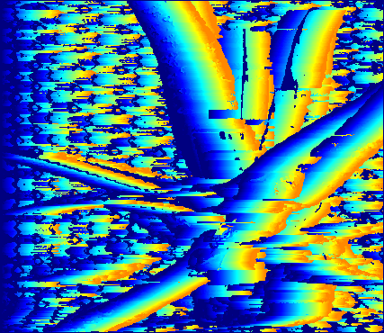

# Noisy example

This is an example of why windows based matching is not working properly in the current implementation.

Let's first take a look at the two pictures.

| Left image | Right image |
| ---- | ----- |
|  |  |

We can clearly observe it is a stereo pair of images. The left image is the reference image and the right image is the target image. But the brightness of the right image is much higher than the left image. This is a common problem in stereo matching.

The disparity map generated by the current implementation is shown below.

The reason why the disparity map is not correct is that the windows based matching is not robust to the brightness difference. The current implementation uses the L2 distance to calculate the similarity between the windows. But the L2 distance is sensitive to the brightness difference. As a result, the disparity map is not correct.

And why the L2 distance is sensitive to the brightness difference? Let's take a look at the formula of the L2 distance.

$$
L2 = {\sum_{i=1}^{n} (x_i - y_i)^2}
$$

The L2 distance is the sum of the squared difference between the two vectors. If the brightness of the two windows is different, the L2 distance will be sensitive.
