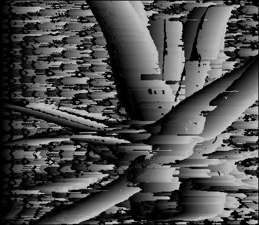

# Stereo Matching Algorithms

Stereo matching is the process of finding corresponding points in two images. This is a fundamental problem in computer vision and has many applications such as 3D reconstruction, depth estimation, and visual odometry. This repository contains the implementation of several stereo matching algorithms.

This repository contains the implementation of the following stereo matching algorithms:

- Pixel Wise Matching
- Window Based Matching

## Pixel Wise Matching

Pixel wise matching is the simplest form of stereo matching. In this method, the disparity of each pixel is calculated independently. The disparity of a pixel is the difference in the x-coordinate of the corresponding points in the left and right images. The disparity is calculated by finding the pixel with the minimum difference in intensity in the corresponding row of the right image.

The implementation of pixel wise matching can be found in the file `pixel_wise.py`. The `pixel_wise` function takes the left and right images as input and returns the disparity map.

Output of Pixel Wise Matching:

| Disparity Map | Disparity Map (Color) |
|---|---|
| |  |

## Window Based Matching

Window based matching is a more sophisticated form of stereo matching. In this method, a window of a fixed size is used to find the corresponding points in the right image. The disparity of a pixel is calculated by finding the pixel with the minimum difference in intensity in the window around the corresponding row of the right image.

The implementation of window based matching can be found in the file `window_based.py`. The `window_based` function takes the left and right images as input and returns the disparity map.

Output of Window Based Matching:

| Disparity Map | Disparity Map (Color) |
|---|---|
| |  |

> Note: The disparity maps are computed using the L2 norm as the distance metric. And the result is explain in this [note](NOISY.md).

## Conclusion

In this repository, I have implemented two stereo matching algorithms: pixel wise matching and window based matching. The pixel wise matching algorithm is simple and fast but may not be accurate in the presence of noise. The window based matching algorithm is more accurate but computationally expensive. The choice of algorithm depends on the application and the trade-off between accuracy and speed.
